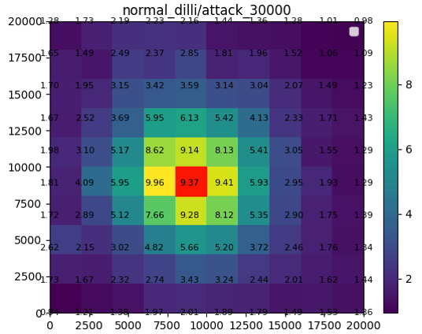
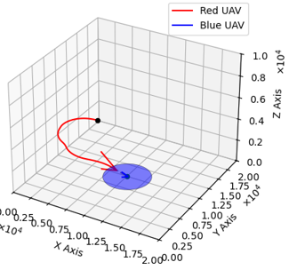

# Air-combat-using-RL

This project simulates an air combat scenario involving Unmanned Aerial Vehicles (UAVs) engaged in a dogfight, where the primary weapon is a machine gun. The UAVs aim to get behind each other to shoot while avoiding attacks. Despite the advancements in missiles and radar, close-range dogfighting remains crucial due to interference from electronic countermeasures and early warning systems. This repository contains implementation of DQN based 1vs1 fixed wing UAV dogfight as described in the paper
["Deep reinforcement learning-based air combat maneuver decision-making: literature review, implementation tutorial and future direction](https://doi.org/10.1007/s10462-023-10620-2).

## How to run

First make sure to install all dependencies listed in the `environment.yaml`. Then run one of the following:

 * To train `python tain.py`
 * To evaluate `python eval.py --n /path_to_.pkl_files`

### Value profile

### Value profile

|  psi = 90deg                         |  psi = 180deg                      |
|:------------------------------------------:|:------------------------------------------------:|
|  |  |

|  psi = -180deg                         |  psi = 220deg                      |
|:------------------------------------------:|:------------------------------------------------:|
|  |  |
